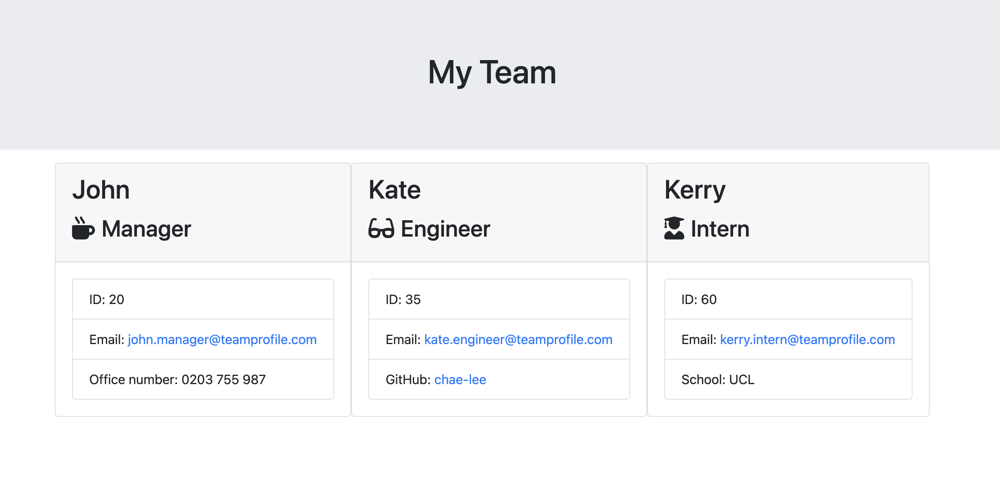

# Team Profile Generator

## Description

- This is a command-line application that takes in information about employees in a software engineering team, then generates an HTML webpage that displays summaries for each person.

## License

## Contents

- [Description](#description)
- [License](#license)
- [Installation](#installation)
- [Usage](#usage)
- [Contributions](#contributions)
- [Tests](#tests)
- [Questions](#questions)

## Installation

- To install dependencies run command
  > npm i

## Usage

- Code is written to dynamically generate a HTML file using the user input to generate a webpage that displays the team’s basic information so that a user have quick access to their emails and Github profiles.

## Contributions

- Pull requests are welcome. For major changes, please open an issue first to discuss what you would like to change.

## Tests

- To run tests, run command
  > npm test

## Questions

- If you have any questions about the repo, open an issue or contact me directly at katelee1129@gmail.com. You can find more of my work at [Chae-Lee](https://github.com/Chae-Lee).

# The final deployed application should look like this

<b> URL to the deployed Application </b>
https://chae-lee.github.io/team-profile-generator/

